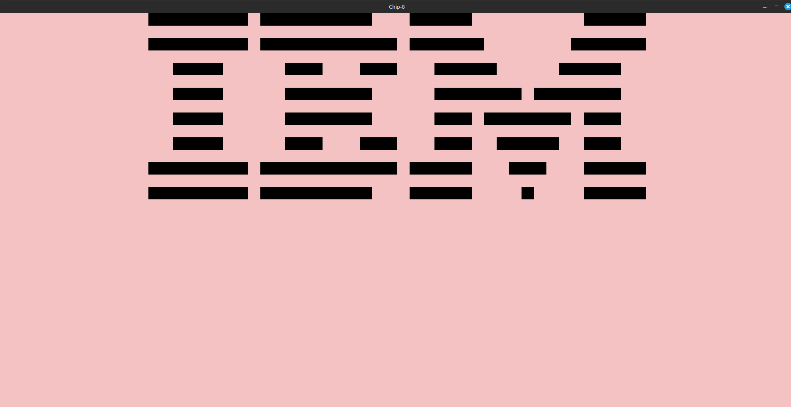

# Chip-8Emulator

Chip-8 is a simple processor with sixteen 8-bit wide registers and 4KB of memory that stores instructions and sprit data from address 0x200 and up. I implemented fetch, decode and execute cycle in my emulator.

## Fetch

Instructions are 16 bit wide hence, each cycle we take up 16 bits from the memory, 8 bits at a time and merge them to make a single instruction.

## Decode

Chip-8 has 35 instrfuctions, each cycle we decoede the instruction into one of these, execute it and increase the value of pc by 2.

## Memory

Chip-8 has 4KB of memory. From address 0x50 to 0x9F, we store built-in sprites for 16 hexadecimal numbers from 0 to F.

Chip-8 also has a 16 level stack to keep track of function calls, whenever a function is called, the PC address of the next instruction without the function call (PC+2 byte) is pushed onto the stack and the top address is popped when a function returns.

## Display
I used Tigr to render display, the emulator, as of now, is capable of making complex visual patterns and animations possible within the constaint of a 62x32 pixel monochrome display (baby pink for the background and black for the sprites).

Below is a screenshot of the result from running IBM logo test on it. 

